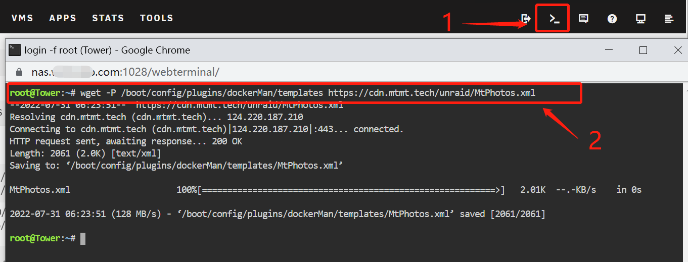
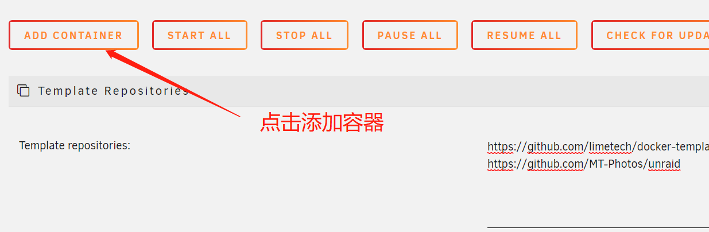
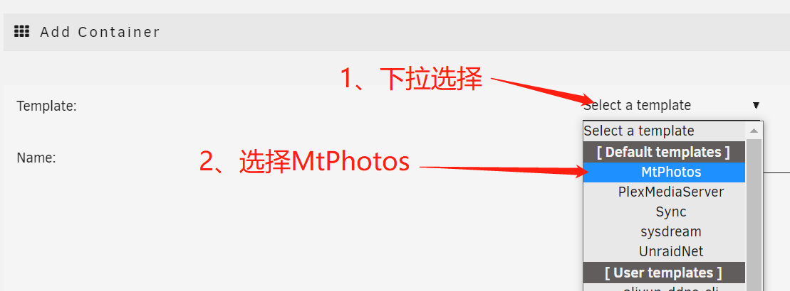
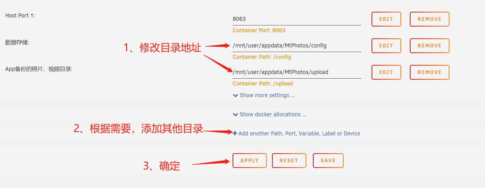

# unraid
MT Photos unraid 模板库

### 使用方法

#### 添加模板

1、打开 unraid 的 终端 页面；

2、在终端中执行以下命令下载模板;
```bash
wget -P /boot/config/plugins/dockerMan/templates https://cdn.mtmt.tech/unraid/MtPhotos.xml
``` 




#### 添加容器

在 Unraid 的Docker中，点击 **ADD CONTAINER** 添加容器



点击 **select a template** 展开下拉菜单，并选中 **MT Photos** 



#### 配置容器

选中之后会自动跳转到预设的配置页面，按照对应的要求填写配置参数：

1. 修改数据存储、App备份文件目录地址
2. 如果还有其他的照片目录，点击 【+ Add another Path, Port, Variable, Label or Device】添加目录；

填完参数后，点击 **APPLY** 



等待unraid拉取镜像，并启动运行
