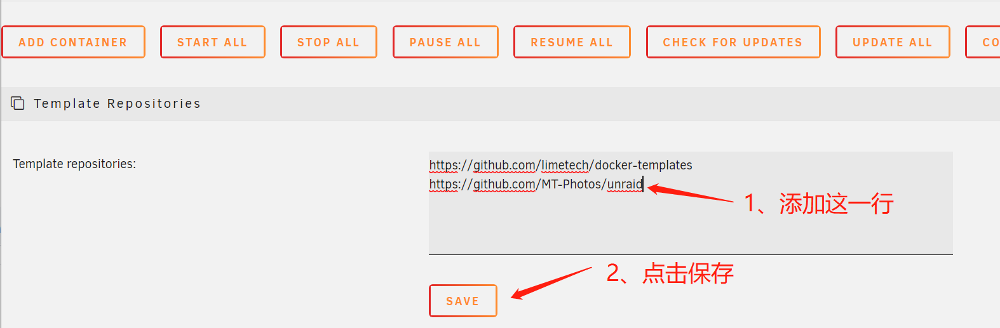

# unraid
MT Photos unraid 模板库

### 使用方法

#### 添加模板库

打开 unraid 的 docker 页面：

1. 将本仓库地址 https://github.com/MT-Photos/unraid 填入 **Template repositories**
2. 点击 SAVE 保存，unraid 会自动拉取模板库并刷新页面

#### 添加容器

在 Unraid 自动刷新页面之后，点击 **ADD CONTAINER** 添加容器

点击 **select a template** 展开下拉菜单，并选中 **MT Photos** 

